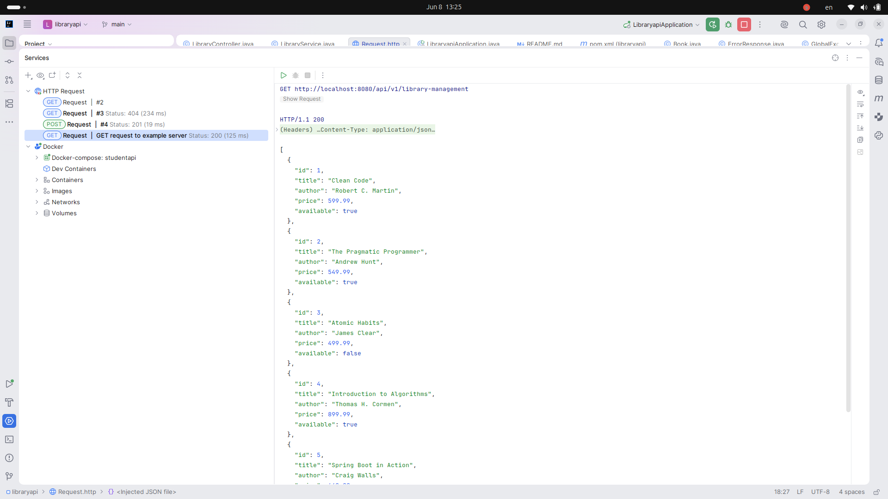
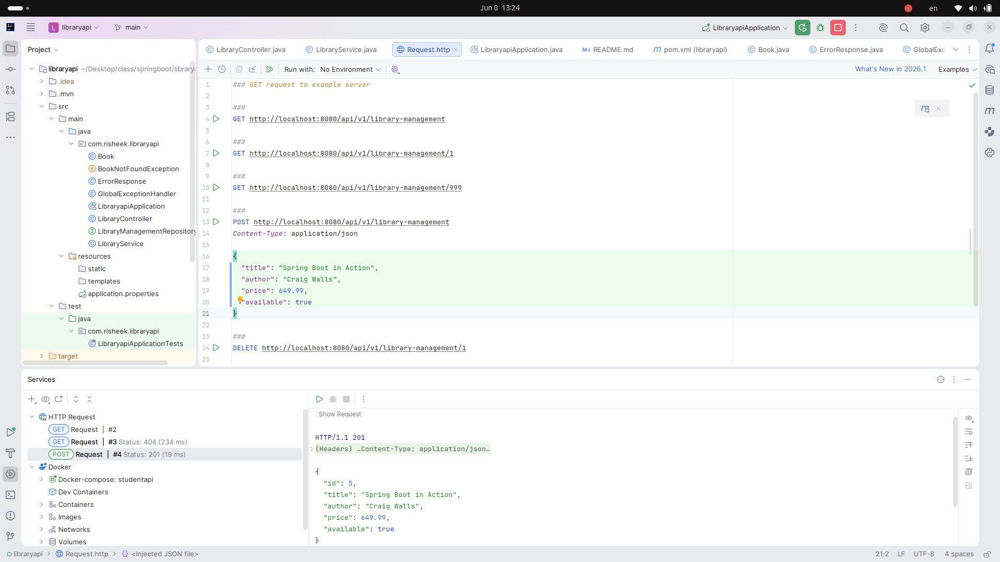
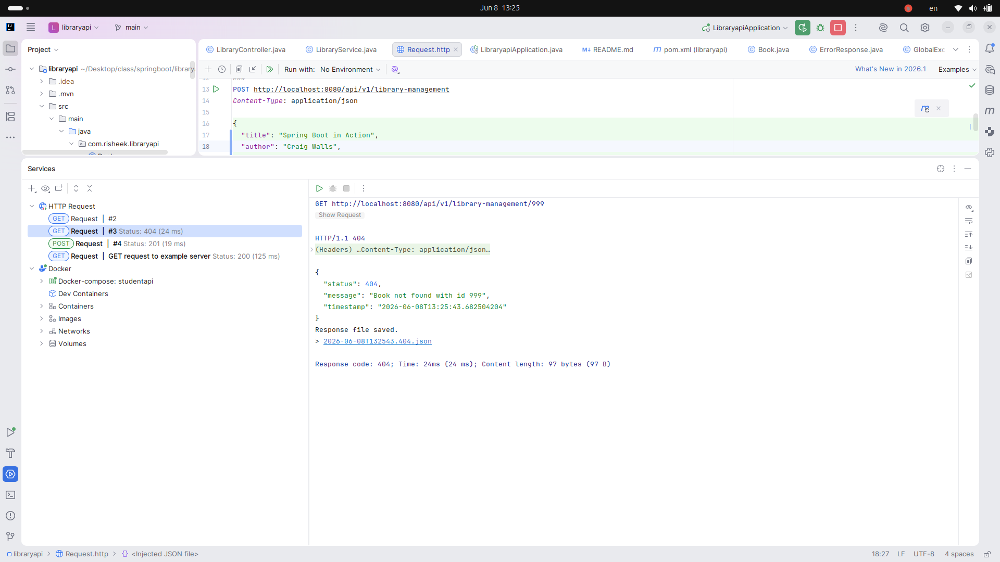
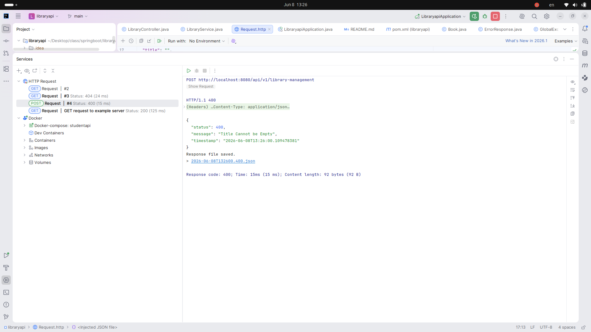
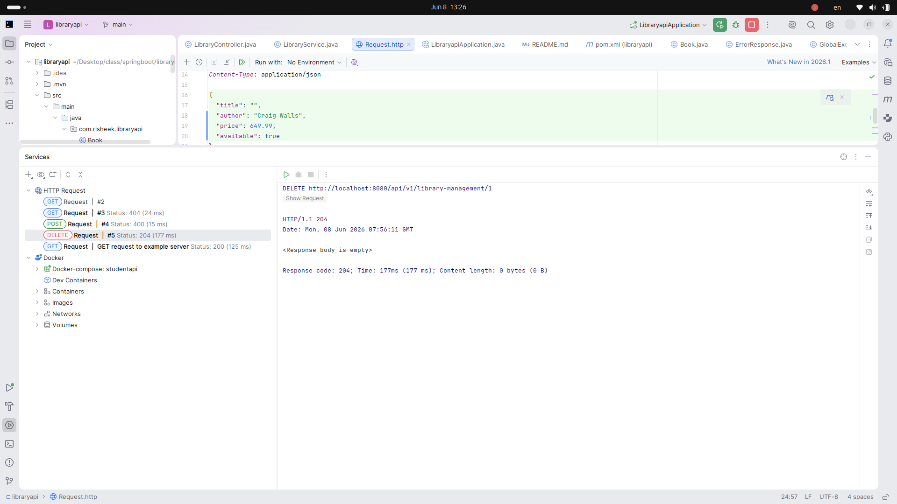

# 📚 Library Management REST API

A RESTful API for managing a library's book inventory, built with Spring Boot 3, Spring Data JPA, and MySQL.

## 🛠️ Tech Stack

- Java 21
- Spring Boot 3.5.14
- Spring Data JPA + Hibernate
- PostgreSql
- Maven
- Postman (API Testing)

## 🚀 Features

- Full CRUD operations for books
- Pagination support for large datasets
- Global exception handling with clean JSON error responses
- Bean Validation on incoming requests
- Proper HTTP status codes (200, 201, 204, 400, 404, 500)
- 3-layer architecture: Controller → Service → Repository

## 📁 Project Structure

src/main/java/com.risheek.libraryapi/
├── LibraryapiApplication.java       # Main entry point — starts the app
├── Book.java                        # Entity
├── BookNotFoundException.java       # Custom exception
├── ErrorResponse.java               # Error response model
├── GlobalExceptionHandler.java      # Handles all exceptions
├── LibraryController.java           # REST endpoints
├── LibraryManagementRepository.java # Database layer
└── LibraryService.java              # Business logic

## ⚙️ Setup & Run Locally

1. Clone the repository
```bash
git clone https://github.com/Risheek-Shrestha/library-management-api.git
```

2. Create PostgreSQL database
```sql
CREATE DATABASE librarydb;
```

3. Update `src/main/resources/application.properties`
```properties
spring.datasource.url=jdbc:postgresql://localhost:5432/librarydb
spring.datasource.username=your_username
spring.datasource.password=your_password
```

4. Run the application
```bash
./mvnw spring-boot:run
```

API will start at `http://localhost:8080`

## 📌 API Endpoints

| Method | Endpoint | Description | Status Code |
|--------|----------|-------------|-------------|
| GET | /api/v1/library-management?page=0&size=5 | Get books with pagination | 200 |
| GET | /api/v1/library-management/{id} | Get book by ID | 200 |
| POST | /api/v1/library-management | Add new book | 201 |
| PUT | /api/v1/library-management/{id} | Update book | 200 |
| DELETE | /api/v1/library-management/{id} | Delete book | 204 |

## 📝 Sample Request

**POST** `/api/v1/library-management`
```json
{
    "title": "Clean Code",
    "author": "Robert C. Martin",
    "price": 599.99,
    "available": true
}
```

**Success Response — 201 Created:**
```json
{
    "id": 1,
    "title": "Clean Code",
    "author": "Robert C. Martin",
    "price": 599.99,
    "available": true
}
```

**Error Response — 404 Not Found:**
```json
{
    "status": 404,
    "message": "Book not found with id: 99",
    "timestamp": "2026-06-08T13:00:00"
}
```
## 📸 API in Action

### Get All Books — 200


### Create Book — 201 Created


### Book Not Found — 404


### Validation Error — 400


### Delete Book — 204

## 👨‍💻 Author

**Risheek Shrestha**
- GitHub: [@Risheek-Shrestha](https://github.com/Risheek-Shrestha)
- Email: shrestharisheek@gmail.com